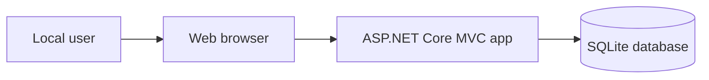
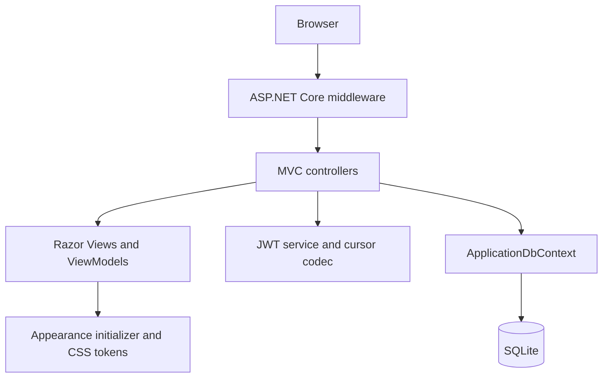
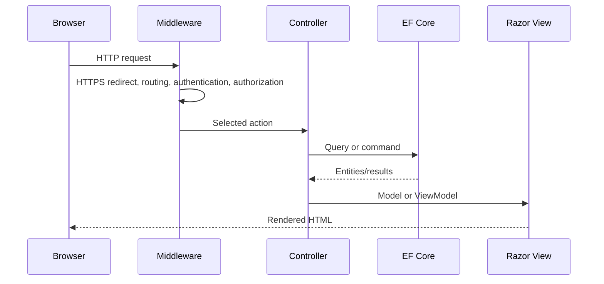
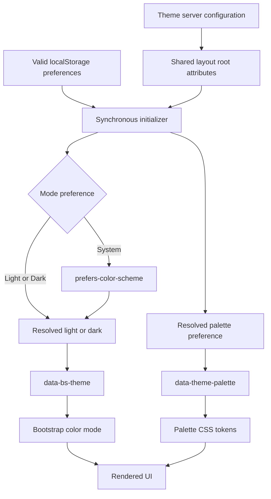
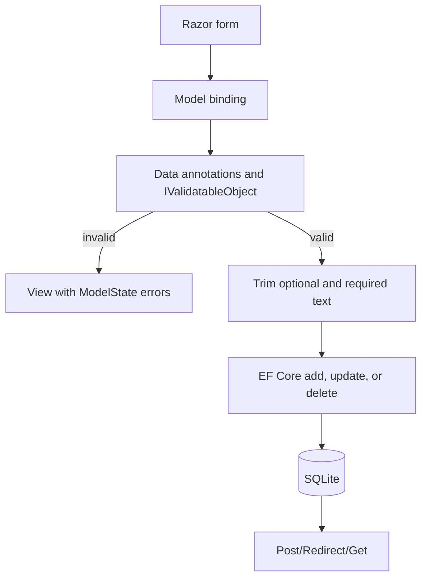
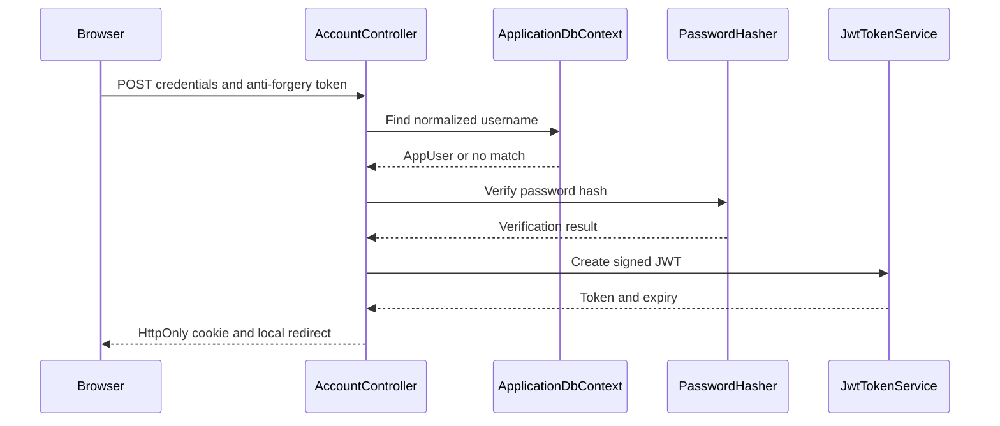
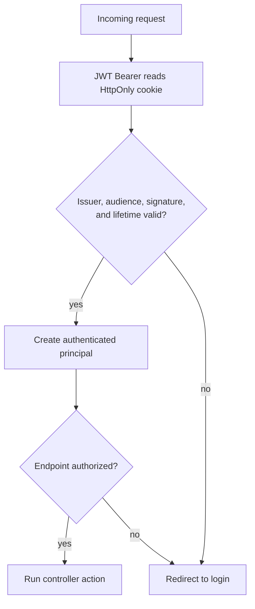
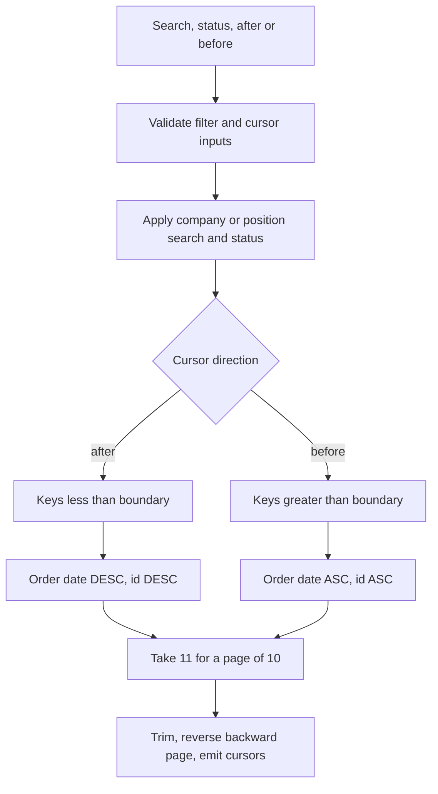
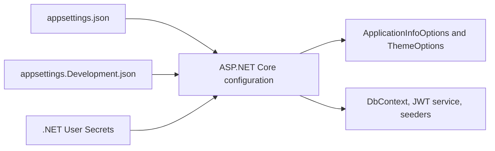

# Architecture

This document describes the architecture implemented in the current Job Application Tracker source. It complements the setup-oriented [README](../README.md).

## System context

Job Application Tracker is a single-process ASP.NET Core MVC application. A browser communicates with the application over HTTP or HTTPS; the application renders HTML and stores its state in a local SQLite database. There are no external APIs or identity providers in the current implementation.



The trust boundary is the web application process. Browser input, query strings, cursors, cookies, and form values are untrusted. The SQLite file and User Secrets are local resources and must remain outside version control.

## Runtime and component architecture



The layers are intentionally lightweight:

- **Domain entities:** `JobApplication`, `AppUser`, and `ApplicationStatus` represent persisted state and core validation constraints.
- **Presentation ViewModels:** `HomeDashboardViewModel`, `JobApplicationIndexViewModel`, and `LoginViewModel` shape data for specific pages and form posts.
- **Controllers:** `HomeController`, `JobApplicationsController`, and `AccountController` orchestrate queries, validation, authentication, CRUD operations, and responses.
- **Services:** `JwtTokenService` creates access tokens. `JobApplicationCursorCodec` is a stateless pagination helper registered as a singleton.
- **Persistence:** `ApplicationDbContext` maps entities to SQLite with EF Core. Migrations define schema history; startup seeders insert initial rows.
- **Views:** Razor Views generate HTML and use tag helpers for routes, forms, validation messages, and anti-forgery fields.
- **Appearance:** `ThemeOptions`, the shared layout, a synchronous initializer, Bootstrap 5.3 color modes, and a token-based stylesheet coordinate browser-local mode and palette choices.

There is no separate repository or domain-service layer. Controllers query EF Core directly, which keeps this small application easy to follow at the cost of tighter presentation/persistence coupling.

## MVC request lifecycle



`Program.cs` registers MVC, EF Core, authentication, authorization, application services, cursor encoding, and options. The runtime pipeline uses HTTPS redirection, routing, authentication, authorization, static assets, and the conventional `{controller=Home}/{action=Index}/{id?}` route. Outside Development, exceptions are routed to `/Home/Error` and HSTS is enabled.

## Shared application shell

The shared layout keeps the navbar and footer surfaces full width while aligning their inner content with the main content through Bootstrap `.container` wrappers. The `body` is a minimum-viewport-height flex column, and the existing main `.container` grows into available vertical space. The footer therefore stays at the viewport edge on short pages and follows content normally on long pages; it has no absolute positioning or fixed-height reservation and can expand when its content stacks on narrow screens.

The header hierarchy is:

1. The **Job Application Tracker** brand.
2. Authenticated primary navigation for Dashboard and Applications.
3. A flexible gap followed by the Appearance utility.
4. An explicit account group containing the username and POST Log out action, or Sign in for anonymous users outside the Login page.

The navbar collapses below Bootstrap's `lg` breakpoint. Active primary links receive Bootstrap's active class and `aria-current="page"` from server-side route data. Appearance is visually separated from a following account group, but no empty divider is rendered when either side is absent. The Login page suppresses the redundant Sign in action, long desktop usernames are visually truncated while their full value remains in the DOM, and no account dropdown is used.

`ApplicationInfoOptions` supplies `CopyrightYear`, `Name`, and `Applicator` to the footer. At `sm` and wider, its metadata group sits opposite the Data & Privacy link and may wrap; below `sm`, the content stacks naturally. The link's visible name is Data & Privacy, while its route remains `Home/Privacy`.

## Appearance resolution and styling

Appearance has two independent preference dimensions:

- **Mode preference:** Light, Dark, or System.
- **Resolved Bootstrap mode:** only `light` or `dark`, written to `data-bs-theme`. System is resolved with `prefers-color-scheme`.
- **Palette preference:** Ocean, Fall, Coffee, Sakura, or Forest, written to `data-theme-palette`.
- **Semantic status colors:** Bootstrap success, danger, warning, info, and neutral colors remain outside palette control.

`ThemeOptions` contains `DefaultMode`, `AllowUserSelection`, `DefaultPalette`, and `AllowPaletteSelection`. `ThemeMode` and `ThemePalette` are closed enums, both default selectors are validated with data annotations, and `ValidateOnStart()` activates startup validation. The shared layout converts enum values through explicit switches before rendering normalized values into these root attributes:

- `data-theme-default`
- `data-theme-selection-enabled`
- `data-bs-theme`
- `data-palette-default`
- `data-palette-selection-enabled`
- `data-theme-palette`



### First-paint and JavaScript lifecycle

The shared layout loads appearance resources in this order:

1. Synchronous `theme-initializer.js`.
2. Bootstrap CSS.
3. `theme-palettes.css`.
4. `site.css`.
5. Generated scoped CSS.

The external initializer runs in the document head without `async` or `defer`. It normalizes server-rendered defaults, safely reads `jobApplicationTracker.theme` and `jobApplicationTracker.palette` when their respective selection policies are enabled, and writes the resolved root attributes before stylesheets are applied. This reduces flashes of the server fallback mode or default accent, although it does not make a flash mathematically impossible in every browser or loading condition.

Mode and palette state remain separate inside the initializer. Storage failures are caught without logging values or interrupting navigation. After DOM readiness, the native radio groups are initialized from the resolved preferences. Valid changes apply immediately and are written to local storage; failed writes still leave the current page updated. Storage events synchronize valid cross-tab changes and restore configured defaults when a key is removed, without writing back. Invalid event values are ignored.

The controls live in one Bootstrap-managed Appearance dropdown. Mode is a custom segmented presentation over a native radio fieldset; Palette is a custom card grid with labeled, decorative swatches over a separate native radio fieldset. Checked and focus-visible styles are CSS-driven, while the inputs retain browser radio semantics. Bootstrap manages disclosure opening and closing; application JavaScript only synchronizes preference state, root attributes, storage, operating-system changes, and cross-tab updates.

For System mode, a `prefers-color-scheme: dark` media query resolves the effective Bootstrap mode and listens for live operating-system changes. Explicit Light or Dark preferences are unaffected by those changes. Mode and palette interaction and storage listeners are independently enabled: disabling one ignores its stored value without deleting it or disabling the other.

### CSS token architecture

`theme-palettes.css` contains one Light and one Dark block for each palette. Each block defines only this application token contract:

- `--app-accent`, `--app-accent-rgb`, `--app-accent-hover`, `--app-accent-active`, `--app-accent-contrast`
- `--app-accent-link`, `--app-accent-link-rgb`, `--app-accent-link-hover`, `--app-accent-link-hover-rgb`
- `--app-accent-focus-ring`, `--app-accent-focus-border`

A shared mapping layer applies the active tokens to Bootstrap's root primary, link, and focus variables. Separate shared mappings override the component-local variables used by `.btn-primary` and `.btn-outline-primary` for default, hover, active, focus, and disabled states. Narrow `.form-control:focus` and `.form-select:focus` rules replace Bootstrap's compiled blue border and ring. Changing only `--bs-primary` would not cover those component-local button variables or compiled focus declarations.

Success, danger, warning, info, and neutral variables are deliberately untouched so application statuses and validation retain their semantic meaning. The five palettes combined with the two effective modes produce ten visual states; the project owner has manually verified all ten and has also verified Light, Dark, and System behavior across multiple browsers. There are no automated browser or accessibility tests.

## CRUD data flow



Create and edit accept an explicit bind allowlist. They trim required strings and convert blank optional strings to `null` after validation. Successful creates and deletes use `TempData` for a confirmation message; edits redirect without a message. Details and delete-confirmation queries use `AsNoTracking`.

Delete requires a confirmation page and a POST. Create, edit, delete, login, and logout POST actions use `[ValidateAntiForgeryToken]`; Razor form tag helpers emit anti-forgery inputs. Missing IDs or records return 404. An edit catches `DbUpdateConcurrencyException`, returns 404 if the row disappeared, and otherwise rethrows; the entity has no explicit concurrency token.

## Authentication and login flow



`UserSeeder` creates one `AppUser` from `SeedUser:Username` and `SeedUser:Password` only when the user table is empty. It normalizes the username with `ToUpperInvariant` and stores an ASP.NET Core Identity password hash. A successful login rehashes the password when the hasher reports that an upgrade is needed.

`JwtTokenService` issues an HMAC-SHA256 token with subject, name identifier, name, and unique token ID claims. Issuer, audience, signing key, and expiration come from configuration. The service rejects signing keys shorter than 32 UTF-8 bytes and non-positive expiry durations.

The response stores the JWT in `JobApplicationTracker.AccessToken` with `HttpOnly`, `SameSite=Strict`, an expiry matching the JWT, root path, and `Secure` conditional on an HTTPS request. Logout deletes this cookie. The token is self-contained; deleting the cookie does not revoke a copied token.

## Authorized request flow



JWT Bearer is both the default authentication and challenge scheme. `OnMessageReceived` copies the authentication cookie value into the handler's token input. Validation checks issuer, audience, signing key, and lifetime with zero clock skew. The name claim populates `User.Identity.Name`.

`[Authorize]` protects `HomeController.Index`, `AccountController.Logout`, and the entire `JobApplicationsController`. Login is anonymous. The `Home/Privacy` and Error actions are also currently anonymous. A failed challenge redirects to `/Account/Login` with the original local path and query as `returnUrl`; login only follows it when `Url.IsLocalUrl` accepts it.

The `Home/Privacy` route now renders the visible **Data & Privacy** implementation overview. It documents current storage, authentication-cookie behavior, browser preferences, secret boundaries, external-service boundaries, deployment responsibility, and limitations without changing authorization or data handling. The existing controller action already returned the view anonymously, so no controller or routing change was required. The page is descriptive project documentation, not a formal legal privacy policy.

## Cursor pagination flow



The canonical list order is `AppliedDate DESC, Id DESC`. `Id` is a deterministic tie-breaker for applications sharing a date. Forward navigation uses rows with an earlier date or, on an equal date, a smaller ID. Backward navigation uses the inverse predicate and ascending order, then reverses the selected page for display.

The controller fetches `pageSize + 1` rows to detect whether another page exists. It also counts the fully filtered result set for the “showing … of …” display. Search uses SQLite `LIKE` against company and position after trimming the input; search terms longer than 100 characters and undefined enum values return 400. Supplying both `after` and `before` also returns 400.

`JobApplicationCursorCodec` serializes `{ appliedDate, id }` as JSON and applies Base64 URL encoding. Decoding rejects malformed Base64/JSON, non-positive IDs, and default dates. This formatting is not encryption or integrity protection. Active search and status values travel separately in pagination links; the cursor is not coupled cryptographically or structurally to those filters.

## Configuration and secret boundaries



Safe shared settings include the SQLite connection string, application display metadata, appearance defaults and selection policies, JWT issuer/audience/expiration, logging, and allowed hosts. `ApplicationInfo` is bound to `ApplicationInfoOptions`. The required `Theme` section is bound to `ThemeOptions`, validated with data annotations, and validated at startup. The connection string, JWT settings, and seed-user settings are read directly from `IConfiguration`.

Appearance configuration is safe to commit and contains no credentials. Browser mode and palette preferences are local presentation state, not authentication data or secrets. They remain in `localStorage` and are not persisted to SQLite or `AppUser`; the feature therefore requires no controller, entity, migration, or database changes.

The JWT signing key and seed-user credentials are intentionally absent from committed configuration and must be supplied through .NET User Secrets for local development. The generated SQLite database is also local state: it may contain password hashes, notes, URLs, and other private job-search data. User Secrets, database files, SQLite WAL/SHM sidecars, and local override configuration belong outside Git.

Configuration precedence follows ASP.NET Core defaults. Environment variables or a deployment secret store can replace User Secrets outside local development, but no deployment-specific provider is configured by this project.

## Database schema overview

```mermaid
erDiagram
    JOB_APPLICATIONS {
        int Id PK
        string CompanyName
        string PositionTitle
        string Source
        string JobUrl nullable
        string Location nullable
        datetime AppliedDate
        int Status
        string Notes nullable
    }
    USERS {
        int Id PK
        string Username
        string NormalizedUsername UK
        string PasswordHash
    }
```

The two tables have no relationship. `NormalizedUsername` has a unique index. SQLite stores the status enum as an integer and dates using EF Core's SQLite mapping. Length/nullability constraints mirror the entity data annotations in the committed migrations.

Two migrations are present: the initial `JobApplications` table and a later `Users` table with its unique username index. `DbInitializer` and `UserSeeder` insert rows but do not call `Database.Migrate`; schema application remains an explicit `dotnet ef database update` step.

## Dependency injection registrations

| Registration | Lifetime | Consumer/purpose |
| --- | --- | --- |
| MVC controllers with views | Framework-managed | Routing, model binding, Razor rendering |
| `ApplicationDbContext` | Scoped | Controllers and startup seeders |
| `IPasswordHasher<AppUser>` → `PasswordHasher<AppUser>` | Scoped | User seeding and login verification |
| `JwtTokenService` | Scoped | `AccountController` token creation |
| `JobApplicationCursorCodec` | Singleton | Application-list cursor encoding/decoding |
| `ApplicationInfoOptions` | Options pipeline | Shared Razor layout metadata |
| `ThemeOptions` | Options pipeline with startup validation | Appearance defaults and selector policies |
| JWT Bearer authentication | Framework-managed | Cookie token validation and challenges |
| Authorization | Framework-managed | `[Authorize]` enforcement |

At startup, a manually created scope resolves the DbContext and password hasher, then executes both seeders before the application begins serving requests.

## Error and validation behavior

- Data annotations enforce required fields, lengths, URL format, and valid status values.
- `IValidatableObject` rejects an applied date later than the server's local `DateTime.Today`.
- Razor inputs and jQuery validation provide client feedback, but controllers always rely on server-side `ModelState` as the authority.
- The list action returns 400 for conflicting/malformed cursors, invalid statuses, and oversized search terms.
- Empty cursor results redirect to the unpaginated filtered list when matching records still exist.
- Lookup failures return 404.
- Non-Development exceptions use the shared error endpoint; Development uses the framework developer exception experience.
- There is no custom exception logging beyond the injected, currently unused `HomeController` logger and framework defaults.

## Trust boundaries and security considerations

- Treat all browser input and cursors as untrusted. Model validation and explicit bind lists reduce over-posting and malformed input risks.
- Anti-forgery validation protects state-changing form posts, including login and logout.
- The HttpOnly cookie reduces direct JavaScript access; SameSite `Strict` limits cross-site sending. The cookie is only marked `Secure` when login occurs over HTTPS, so local use should prefer the HTTPS launch URL.
- JWT validation uses an HMAC secret. That key must be high entropy, at least 32 bytes, kept outside Git, and shared only with trusted application instances.
- A Base64 URL cursor leaks its decoded date and ID to anyone who decodes it and can be modified. Query predicates limit the effect to navigation, but signed cursors would provide stronger integrity.
- Every authenticated user would currently access the same job-application records because there is no owner foreign key or per-record authorization.
- The local SQLite file contains private operational data and a password hash. Ignoring it prevents accidental addition but does not encrypt it at rest.
- Authentication lacks refresh, revocation, MFA, lockout, recovery, registration, roles, key rotation, and multi-user management.

## Architectural trade-offs

- **Direct controller-to-EF access:** concise and appropriate for a small portfolio application, but harder to isolate in unit tests and more coupled than a dedicated application layer.
- **SQLite:** requires almost no local infrastructure and makes the project easy to run, but is not designed for high write concurrency or horizontally scaled deployment.
- **Keyset pagination:** avoids increasingly expensive offsets and remains stable when rows are inserted around other pages; it cannot jump to an arbitrary page number and requires a unique composite order.
- **JWT in an HttpOnly cookie:** demonstrates token creation and JWT Bearer validation while keeping the token out of browser JavaScript. For server-rendered MVC, conventional Identity cookie authentication would simplify sessions, revocation, and account management.
- **Startup seeding:** offers an immediately populated local experience, but couples startup to required secret configuration and embeds sample records in production code.
- **Entity validation attributes:** keep constraints close to the data model and power both MVC and migration metadata, but mix persistence/domain concerns with presentation error text.
- **Explicit migrations:** make schema evolution reviewable and reproducible, but require an operator or setup step because migrations are not applied at runtime.
- **Browser-local appearance:** avoids database and account coupling, but preferences do not follow a user to another browser or device.
- **Synchronous external initializer:** improves first-paint consistency while remaining compatible with a future restrictive script policy more easily than inline code, but adds a render-blocking request.
- **Single token stylesheet:** centralizes all palette/mode combinations and shared Bootstrap mappings with less duplication than one stylesheet per palette, at the cost of loading definitions for inactive palettes.
- **Closed palette enum:** makes server validation and browser normalization predictable, but does not support arbitrary user-defined colors.
- **Custom-styled native radios:** provide segmented and card-based controls without the scripting and accessibility burden of a custom ARIA selection widget, but require dedicated CSS across modes and palettes.
- **One Appearance disclosure:** keeps utilities from dominating the navbar, but adds an interaction before a preference can be changed compared with always-visible controls.
- **Shared `.container` alignment:** gives the navbar, main content, and footer consistent gutters and maximum widths, but deliberately avoids a wider application shell for dense pages.
- **Implementation privacy overview:** documents repository behavior in context without presenting deployment-specific legal promises, but operators must still assess their own environment and obligations.
